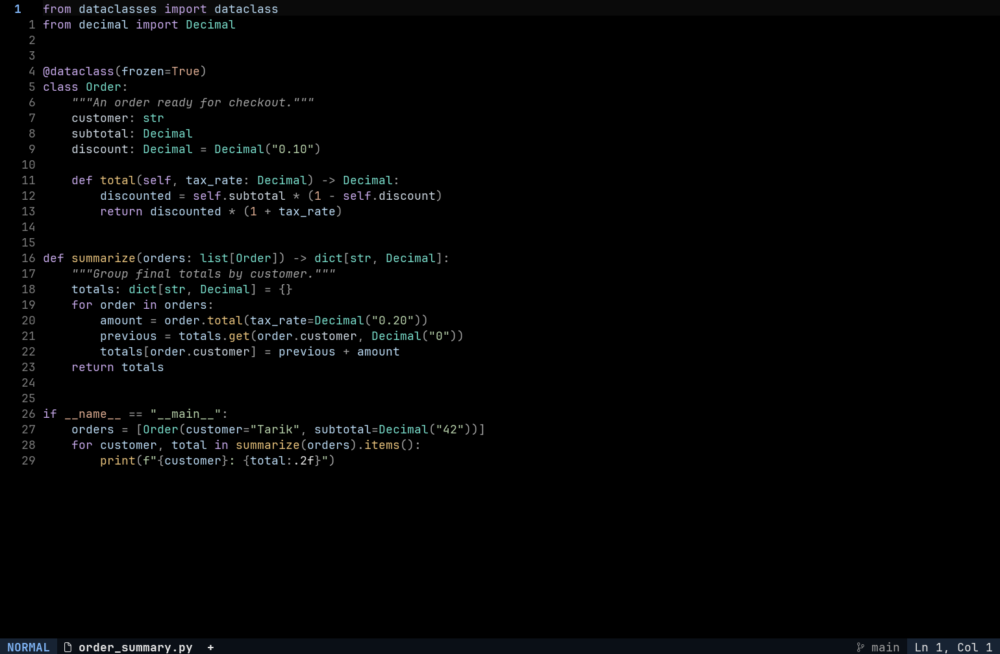
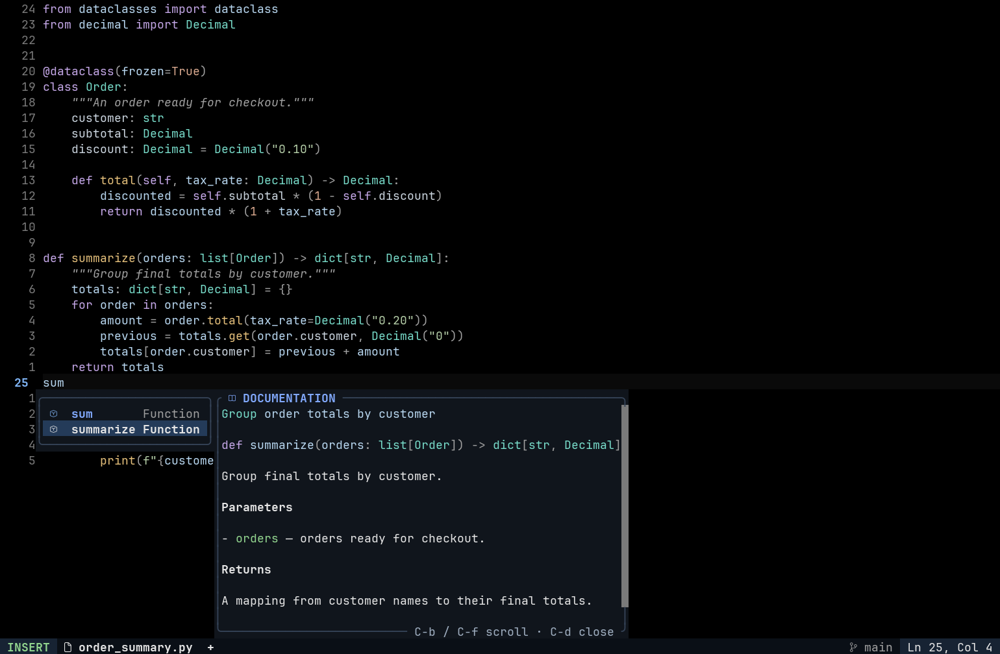

# 1337-session

My 1337 Session Setting: nvim, vscode, zsh and also Zed.

## Perfect Black Neovim

Pure black editing, clearer Python colors, a redesigned documentation panel,
and a composed status bar. JetBrains Mono with selective italics. Python uses
`ty` and Ruff.





Actual Neovim UI-grid captures. Python and completion content are demonstration
fixtures. See the [Neovim guide](nvim/README.md) for command, workspace, and search
screenshots, shortcuts, and font setup. [Design notes](nvim/DESIGN.md) explain the
palette, behavior, and testing limits.

## One-command dev environment (Ubuntu, zero sudo)

```sh
git clone https://github.com/laghzal49/1337-session.git && ./1337-session/install.sh
```

`install.sh` builds the complete environment into `~/.local` from official
prebuilt binaries — **never calls sudo, never leaves $HOME**:

- JetBrainsMono **Nerd Font Mono** (regular, bold, italic, and bold-italic faces
  for the UI's icons and italic comments; select this family in the terminal)
- **Neovim** latest stable + this repo's config linked to `~/.config/nvim`
  (an existing config is backed up, never deleted)
- **ripgrep · fd · fzf · lazygit**
- **Node.js LTS** (for LSP/mason packages that need npm)
- **uv**, plus a managed Python if the system one can't create venvs
- **ty** and **Ruff** installed through uv's user tool directory
- **tree-sitter CLI**, and a `cc` shim via zig if the box has no C compiler
- image/PDF dependency checks for ImageMagick (`magick`), Poppler
  (`pdftotext`), Kitty, and `xdg-open`; desktop integrations are reported
  clearly but are not impersonated when this no-sudo installer cannot provide
  a safe portable binary
- plugins preinstalled headlessly, so the first launch is instant

Idempotent — re-run it any time; installed tools are skipped
(`--force` reinstalls, `--no-sync` skips the headless plugin download).
The installer supports Linux `x86_64` and `aarch64`, keeps downloads and
temporary files under `~/.local`, and never calls `sudo`. It does not claim to
install a desktop terminal, `xdg-open`, Poppler, or ImageMagick when the
operating system does not provide a trustworthy user-local release binary.

## Personal dotfiles

Current shell, terminal and desktop configs are in [`dotfiles/`](dotfiles/README.md), with restore instructions.
