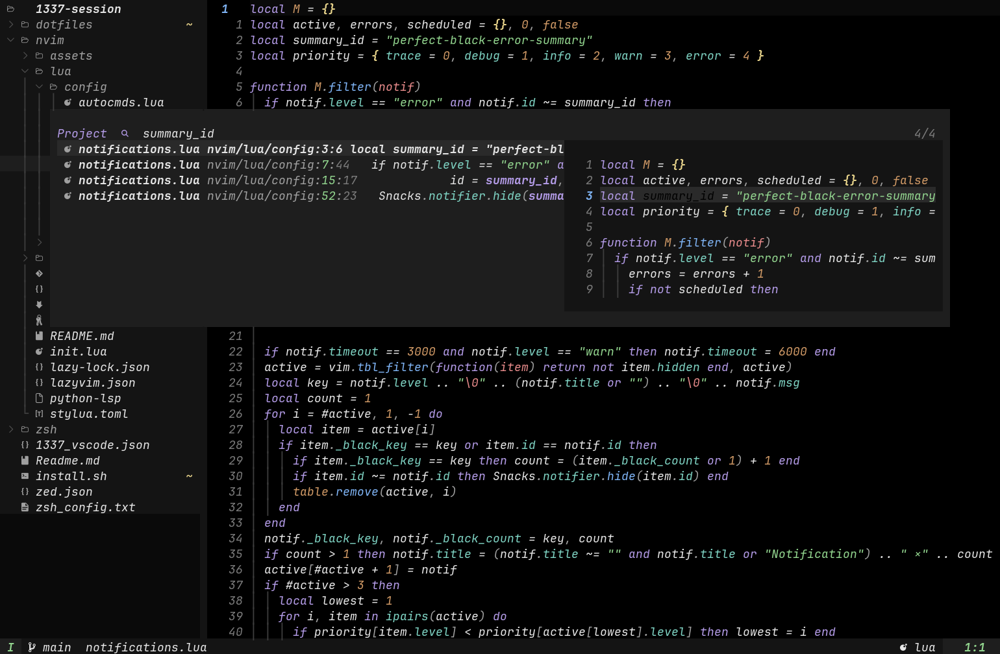

# 1337-session

My 1337 Session Setting: nvim, vscode, zsh and also Zed.

## Perfect Black Neovim

Pure black editing, adaptive search, quiet icons, and JetBrains Mono Nerd Font
Mono Italic. Python uses `ty` and Ruff.



Actual Neovim UI-grid capture, rendered with JetBrains Mono Nerd Font Mono
Italic and Bold Italic. See the [Neovim guide](nvim/README.md) for shortcuts and
font setup, or the [design notes](nvim/DESIGN.md) for decisions and test results.

## One-command dev environment (Ubuntu, zero sudo)

```sh
git clone https://github.com/laghzal49/1337-session.git && ./1337-session/install.sh
```

`install.sh` builds the complete environment into `~/.local` from official
prebuilt binaries — **never calls sudo, never leaves $HOME**:

- JetBrainsMono **Nerd Font** (the UI's icons)
- **Neovim** latest stable + this repo's config linked to `~/.config/nvim`
  (an existing config is backed up, never deleted)
- **ripgrep · fd · fzf · lazygit**
- **Node.js LTS** (for LSP/mason packages that need npm)
- **uv**, plus a managed Python if the system one can't create venvs
- **tree-sitter CLI**, and a `cc` shim via zig if the box has no C compiler
- plugins preinstalled headlessly, so the first launch is instant

Idempotent — re-run it any time; installed tools are skipped
(`--force` reinstalls, `--no-sync` skips the headless plugin download).

## Personal dotfiles

Current shell, terminal and desktop configs are in [`dotfiles/`](dotfiles/README.md), with restore instructions.
