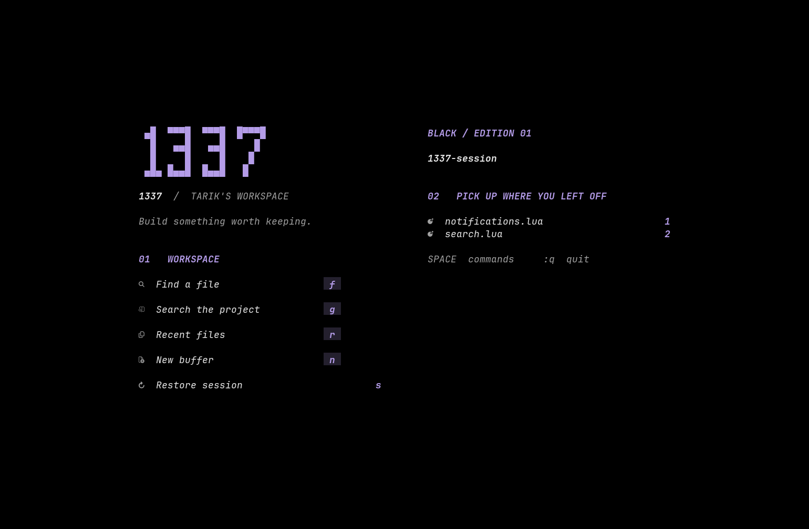
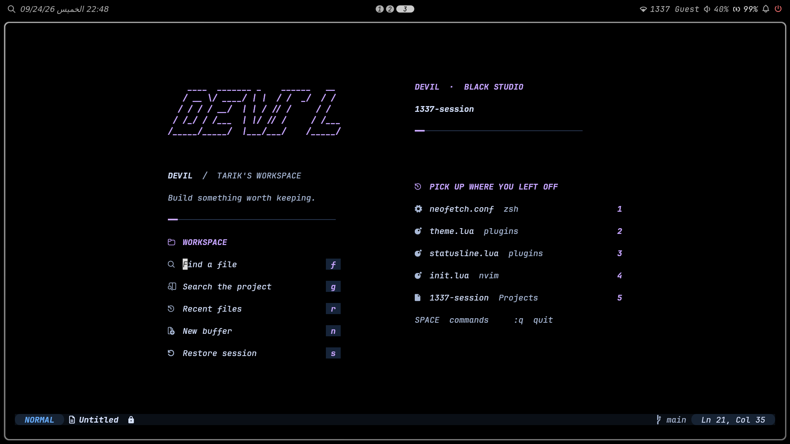
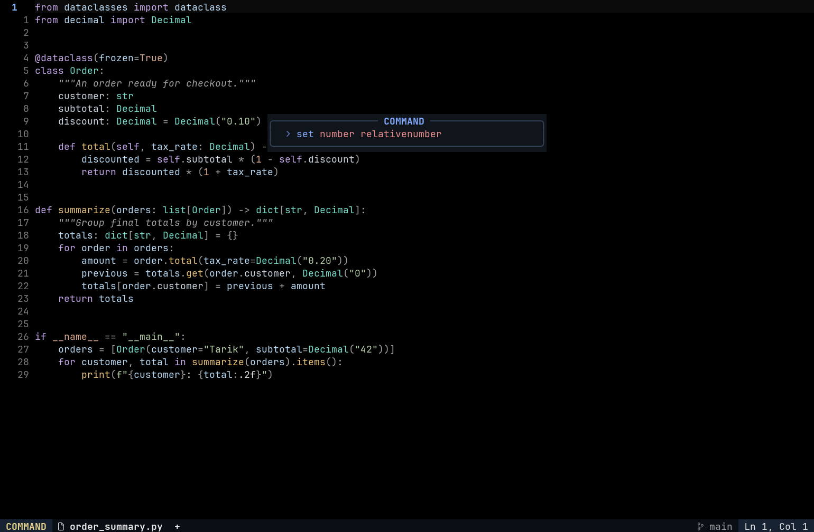
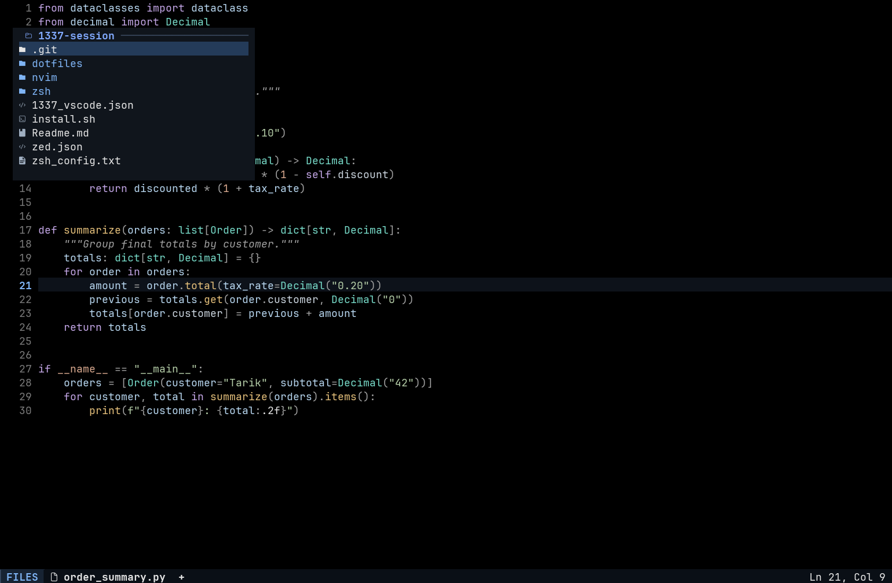

# Perfect Black Neovim

A standalone Neovim configuration: **no LazyVim distribution**. lazy.nvim manages
36 explicitly configured plugins and dependencies, pinned in `lazy-lock.json`.
Pure-black code, italic comments, opaque panels, and **ty + Ruff** for Python.

## Workspace





Blue-tipped section rules, matching icons, and a compact layout at 80×24.
Search and file panels use a single top rule; the active tab has a blue marker.

## Editing surfaces




These are actual UI-grid captures. The Python and browser images show this
revision; documentation and command images retain the previous editing surfaces.
The documentation image uses a demo completion source. The new Mini Pick
and Aerial layouts are tested at narrow and wide sizes; older Snacks picker images
are intentionally no longer presented as current UI.

## File browser beside Python



Mini Files uses short directory titles, padded columns and an 18-row cap. Open
with `<leader>e` (or `<leader>fm` for the current file). In the tree, `h`/`l`
move between directories and `a` inserts a new entry. Type `notes.md` for a
file or `docs/` for a directory, then press `<Esc>` and `=`. The confirmation
list shows exactly what will happen: press `y`/`<Enter>` to apply or `n`/`<Esc>`
to cancel. `r` edits the selected name, `d` marks it for deletion, `q` closes,
and `g?` opens Mini Files' complete help. Changes are not written until `=`
is confirmed.
Python has a clearer active line and quiet active-scope guides.

Markdown reader mode is available with `<leader>mr` (or
`:MarkdownReaderEnable`/`:MarkdownReaderDisable`); it enables rendered Markdown,
comfortable wrapping, spelling, concealed syntax, and a distraction-free view,
then restores the previous window settings when toggled off. Rendering is bounded
for very large files and keeps links, code languages, checkboxes, tables, quotes,
and YAML front matter readable. PDFs open as searchable text automatically; use `:PdfOpen`
or `<leader>fp` to launch an installed external viewer such as Zathura.

Images use `3rd/image.nvim` only when an image-capable Kitty terminal is detected.
Open an image with `<leader>fi` or `:ImageView`; use `<leader>fI`/`:ImageOpenExternal`
for the system viewer, and `:ImageInfo` to inspect available support. The workflow
falls back to `xdg-open`/`open` and never prevents Neovim from starting when Kitty,
ImageMagick, or the plugin is unavailable.

## The smaller workflow

- **Mini Pick + Mini Extra:** files, live grep, buffers, commands, diagnostics and
  symbols. Ctrl-P switches between results and preview in the same window.
- **Mini Files:** the only file browser. Edit filenames like a buffer, then press
  `=` to review/synchronize operations. One column on narrow terminals.
- **Aerial:** on-demand code outline, with Tree-sitter and LSP backends.
- **Glance:** peek at definitions/references without leaving the source.
- **Quicker:** editable quickfix with expandable context.
- **Tiny Inline Diagnostic:** wrapped cursor-line errors, quiet during insertion.
- **Magazine completion:** plain readable labels, kind icons, on-demand docs.
- **TreeSJ, incremental rename, selected text objects:** editing tools with no
  permanent panels. Native inlay hints are off until you toggle them.

Snacks remains for its dashboard, terminal, input, indentation and Git UI; its
picker and explorer are disabled. Neo-tree, Namu, Colorful Menu and Endhints are
removed. There are no inherited distribution keymaps or background tool installs.

## Keys

`<leader>` is Space.

| Action | Keys |
|---|---|
| Find files / search text | `<leader><space>` / `<leader>/` |
| Buffers / recent files | `<leader>,` / `<leader>fr` |
| Commands / keymaps / help | `<leader>sC` / `<leader>sk` / `<leader>sh` |
| Preview / mark / send marked to quickfix | `Ctrl-P` / `Tab` / `Alt-Enter` in picker |
| Toggle file browser | `<leader>e` |
| Browse current file / project | `<leader>fm` / `<leader>fM` |
| Code outline / find file symbol | `<leader>cs` / `<leader>ss` |
| Find workspace symbol | `<leader>cS` |
| Peek definition / references | `<leader>cgd` / `<leader>cgr` |
| Definition / references / hover | `gd` / `gr` / `K` |
| Rename / code action / format | `<leader>cr` / `<leader>ca` / `<leader>cf` |
| Split/join structure | `<leader>cj` |
| Editable quickfix / expand / collapse | `<leader>xQ` / `>` / `<` |
| Indentation / subword text objects | `ii`, `ai` / `iS`, `aS` |
| Completion docs toggle / open and scroll | `Ctrl-D` / `Ctrl-B`, `Ctrl-F` in insertion |
| Native hints / format-on-save toggle | `<leader>uh` / `<leader>uf` |
| Notification history / dismiss | `<leader>n` / `<leader>un` |
| Terminal / Git UI | `<leader>ft` / `<leader>gg` |
| Image view / external / support | `<leader>fi` / `<leader>fI` / `<leader>f?` |
| Restore session | `<leader>qs` |
| Save / previous buffer / next buffer | `Ctrl-S` / `Shift-H` / `Shift-L` |

Quicker `:w` updates source buffers. Previously unmodified buffers are autosaved;
already modified buffers remain unsaved. Ruff can reformat TreeSJ layouts on save.

Notification history retains the latest 500 messages, capped at 16 KiB each, and
reports discarded records. Errors stay visible until acknowledged; their aggregate
count survives rollover, but older details can age out. History is session-only.

## Setup / update

Requires **Neovim 0.11+**, Git and ripgrep. Select **JetBrainsMono Nerd Font Mono,
13 pt** in the terminal, with its real Italic face. Terminal fonts are not set by Lua.
Use the [repository installer](../Readme.md) for the no-sudo workstation setup.

For an existing installation, update the repository, then run `:Lazy restore`.
After checking that the new config works, `:Lazy clean` removes unused plugin
checkouts. This does not remove project data.

Install Python tools with `uv tool install ty` and `uv tool install ruff`, ensuring
uv's executable directory is on PATH before opening Neovim. `:ConfigTools` reports
missing executables. `:Mason` is available for manual tool management.

Install syntax parsers once (the installer also does this):

```vim
:TSInstall python c cpp lua vim vimdoc query markdown markdown_inline
```

Project roots use canonical paths. Activate your environment before opening
Neovim; restart it after switching environments. Project `.venv` discovery stays
with ty. No environment paths tied to a particular desk are hardcoded.

## Verification

Run from the repository root with installed plugins and Python `msgpack`:

```sh
NVIM_BIN=/path/to/nvim python3 nvim/tests/ui_review.py
nvim --headless -u NONE -l nvim/tests/python_environment.lua
NVIM_TY=/path/to/ty nvim --headless -u NONE -l nvim/tests/real_ty.lua
nvim --headless '+lua dofile("nvim/tests/standalone.lua")' +qa!
python3 nvim/tests/startup_bench.py --runs 5
```

Use your installation's `XDG_DATA_HOME`. UI checks cover Mini Pick files/grep/
preview, diagnostics, notifications, documentation controls, quickfix edits,
Mini Files, Aerial, Glance and rename. The standalone test requires ty on PATH
and verifies actual attachment and diagnostics through the full config.

Tests use temporary files. Headless startup timings do not measure cluster NFS
or interactive language-server latency. See [design decisions](DESIGN.md).
