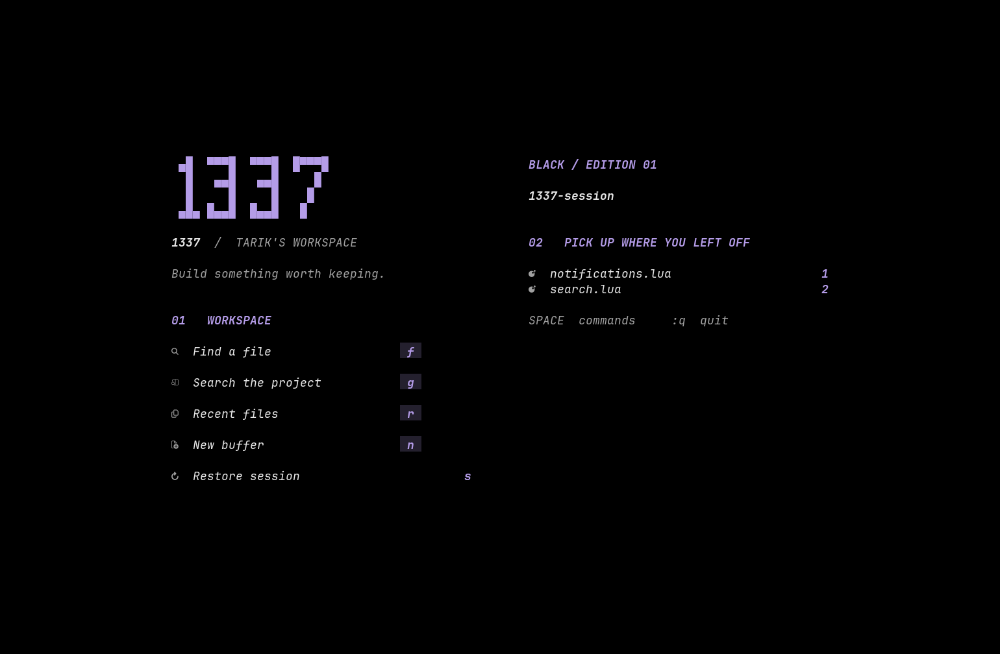
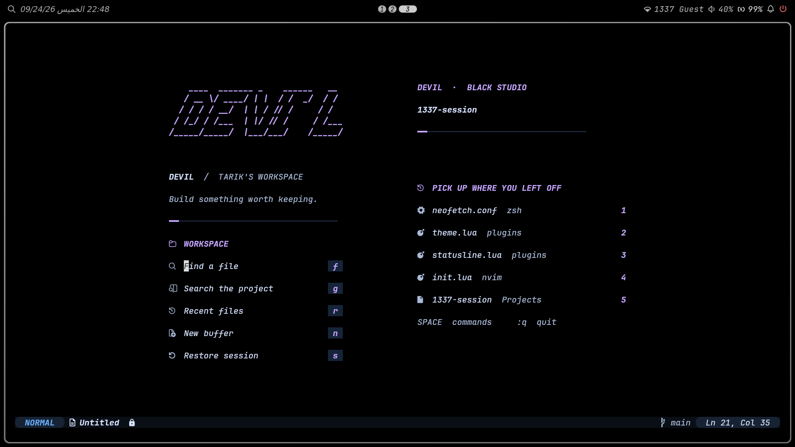
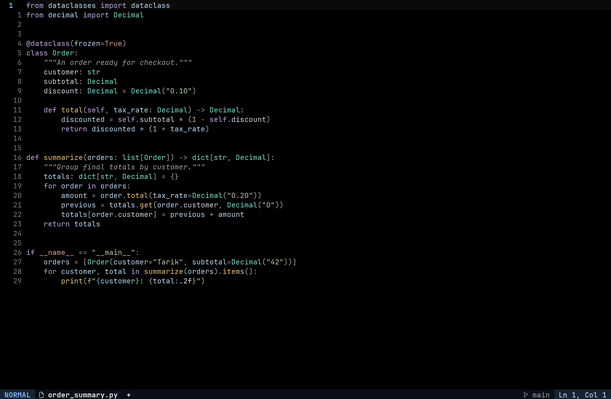
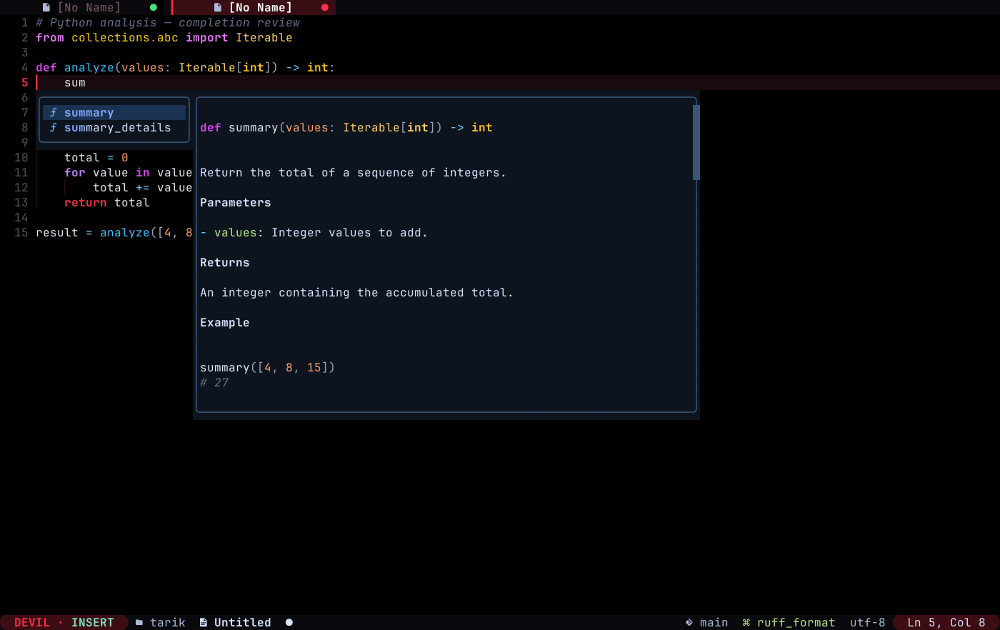
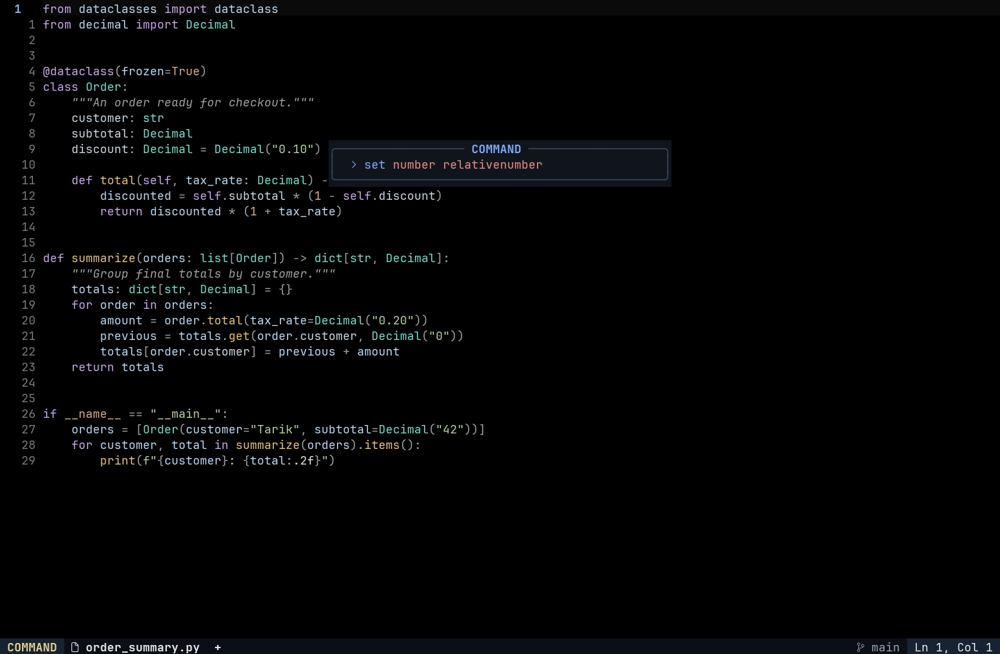
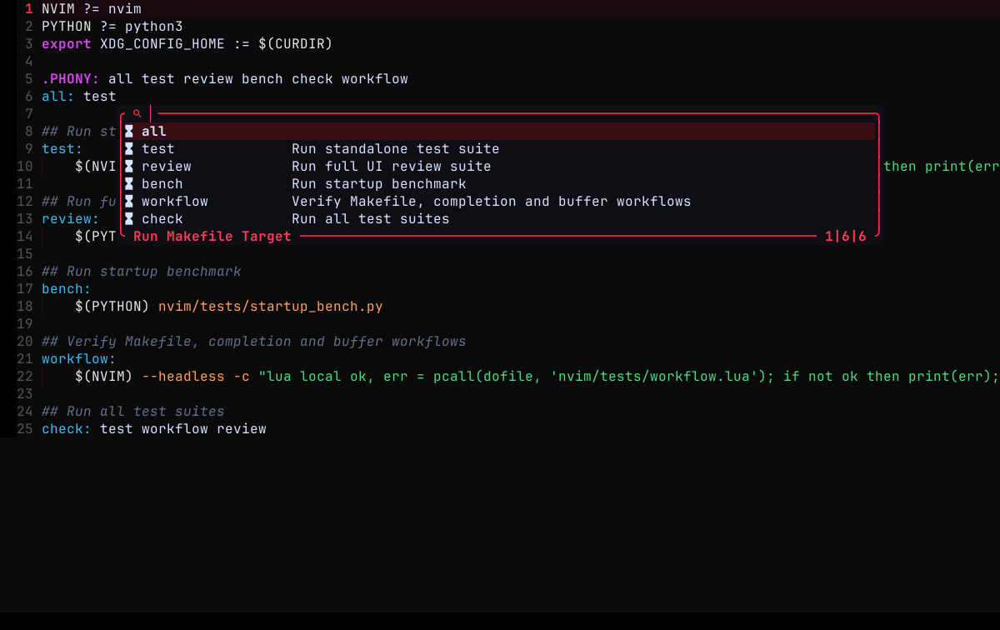

# Perfect Black Neovim

A standalone Neovim configuration: **no LazyVim distribution**. lazy.nvim manages
43 explicitly configured plugins and dependencies, pinned in `lazy-lock.json`.
Pure-black code, italic comments, opaque panels, and **ty + Ruff** for Python.
Ruff provides diagnostics through its LSP and formats with
Ruff Format on save; `<leader>cf` runs formatting manually and `<leader>uf`
toggles format-on-save.

## Workspace





The current theme uses blood-red accents over black editing surfaces.
The dashboard and older editing screenshots below document earlier revisions.

Navigation now gives a subtle 180 ms destination beacon for definitions,
references, diagnostic jumps, jump history, search selection, buffer switching,
Flash, Aerial and quickfix selection. Ordinary `hjkl` movement stays quiet.
The physical cursor uses a block in Normal/Visual, a bar in Insert/Command,
and an underline in Replace; terminal support determines cursor colors.

Split focus keeps inactive windows dim and uses one native red separator anchor.
Panel highlights are preserved, including Edgy. At 120 columns or wider, the
existing statusline shows the enclosing function/class from an idle-updated
cache. Python, C/C++ and Lua use Tree-sitter; other languages can reuse
already-populated Aerial data. It hides at top level and above 10,000 lines or
1 MiB. No extra status row or sidebar is added. The overview rail is deferred.

Harpoon has been removed; use the existing buffer picker and `Shift-H`/`Shift-L`.
Command suggestions use Blink in Noice's command input: Tab selects a suggestion,
Enter accepts and executes it. Suggestions never replace your input automatically.

## Editing surfaces







The completion image is captured from the current Blink UI using a demo source;
the Python palette and command images are from earlier revisions. The Makefile
screenshot below is also regenerated from the current configuration.

## File browser

Snacks Explorer is the only file browser. Open it with `<leader>e` (toggle)
or `<leader>fe`. Use `<CR>` to open, `a` to create, `r` to rename, `d` to delete,
and `?` for its keymap help. Mini Files and its obsolete decoration code are
removed.

Markdown reader mode is available with `<leader>mr` (or
`:MarkdownReaderEnable`/`:MarkdownReaderDisable`); it enables rendered Markdown,
comfortable wrapping, concealed syntax, and a distraction-free view,
then restores the previous window settings when toggled off. Rendering is bounded
for very large files and keeps links, code languages, checkboxes, tables, quotes,
and YAML front matter readable.

Markdown above 5,000 lines or 512 KiB uses a plain view with manual folds,
without Tree-sitter highlighting/context or rendering. These thresholds are
configurable in `config.markdown`. Reader mode avoids spellchecking and restores
window options when returning to code. Small files keep normal rendering.

The leader popup is **BLACK DECK**, rendered by the existing Which-Key. Immediate
commands come first, followed by Code/Docs and project/system groups. `›` marks a
group. Escape closes; Backspace returns from a nested group. `:BlackDeck` enables
Which-Key's supported repeating mode. Existing keypaths remain available.

Documentation keys:

- `K`: Smart Docs. Qualified offline reference first, then asynchronous LSP/project
  hover, then the existing Python builtin fallback or useful local docs search.
- Insert `Ctrl-K`: compact signature help only; it never opens a reference manual.
- `gK`: Deep Docs. Exact offline reference or MiniPick search, without LSP content.

Press `K` again to focus the reference surface. Normal Vim scrolling and `/` work
there; `q` or Escape closes it. Offline pages support `Ctrl-O` history and Enter on
an exact indexed reference. Blink retains automatic completion docs and `Ctrl-b`,
`Ctrl-f`, `Ctrl-d` scrolling/toggling. All reference surfaces share Perfect Black
colors, bounded dimensions and the existing Markdown renderer.

Python 3.14, C, C++, Lua 5.1, Bash and CMake are the default external references.
They describe those versions, not every dependency or project API. Local manuals
and prebuilt exact/fuzzy indexes live in `stdpath("data")/perfect-black/docs`,
outside Git. Lookup never downloads documentation or scans page files.

```vim
:Docs
:Docs python Path
:Docs update python
:Docs health
:DocsBrowse
:DocsBrowse Path
:DocsBrowse python Path
:DocsUpdate
:DocsUpdate python
:DocsHealth
```

An already-open session can register these commands without restarting:
`:lua require('config.docs_lifecycle').setup()`. `:Devdocs` and `:DevdocsUpdate`
remain aliases for the earlier command names.

The installer attempts the initial download without failing the installation when
offline. Neovim checks the small manifest and index-file presence five seconds
after startup and asynchronously updates missing or stale sets. It performs no
startup network work. Configure before setup:

```lua
vim.g.black_docs_auto_update = true -- false disables automatic downloads
vim.g.black_docs_max_age_days = 7
```

Shell equivalent: `scripts/update-docs all` or `scripts/update-docs python`.
The launcher uses uv; the stdlib-only Python 3.11+ backend can also run directly:
`python3 nvim/scripts/update_docs.py all`. Updates publish immutable generations
through an atomic manifest, with a lock against concurrent updates. Failed updates
preserve existing manuals. `--catalog FILE` supports additional docsets.

Anchored pages show the actual reference section, with a 200-line display cap and
an explicit source link; `gx` opens that link only when requested. Pages above
1 MiB are refused. Ambiguous symbol names go to search, not a guessed namespace.

On idle, supported LSPs underline semantic uses of the cursor symbol within the
viewport. Moving or entering Insert clears them immediately; unsupported servers
show no potentially misleading text matches. This replaces Mini Cursorword.
Multiple LSP locations and code actions use the existing picker; Tab previews
locations or replacement text already supplied by the server. Glance remains
the explicit peek tool.

## Makefile targets



Actual Neovim UI-grid capture of the current configuration. Use `<leader>cm`
or `:Make` to pick a target, `:Make test` to run one directly, and `<leader>cM`
to run the Makefile's default target in a terminal. `:MakePick` also opens the
picker. The picker lists literal targets in the root Makefile; included files,
variable-generated targets, and pattern rules are not expanded. GNU Make runs
the recipe with its normal dependencies and variable expansion.

DAP and its debugger UI are removed. Run `:Lazy clean` to remove unused local
plugin checkouts after updating, then restart Neovim.

## The smaller workflow

- **Mini Pick + Mini Extra:** files, live grep, buffers, commands, diagnostics and
  symbols. In the picker, Up/Down or Ctrl-P/Ctrl-N moves through results, Tab
  toggles preview, Ctrl-X marks a result, and Enter opens the selected result.
- **Snacks.explorer:** modern, fast file explorer with tree navigation, git status indicators, LSP integration, floating/sidebar layouts, and built-in file operations.
- **Aerial:** on-demand code outline, with Tree-sitter and LSP backends.
- **Glance:** peek at definitions/references without leaving the source.
- **Quicker:** editable quickfix with expandable context.
- **Tiny Inline Diagnostic:** wrapped cursor-line errors, quiet during insertion.
- **Blink completion:** LSP, paths, snippets and buffer words, with documentation
  and signature help. Enter accepts an explicitly selected item; otherwise it
  inserts a newline. Ctrl-E dismisses completion. Insert Ctrl-K opens only the
  function signature and active parameter documentation, bounded to eight rows.
  Missing signature responses do not fall back to a large hover or reference page.
  Smart K provides contextual/reference documentation in Normal mode. Delayed
  replies are ignored after moving or editing. Use Ctrl-D to toggle completion
  docs and Ctrl-B/Ctrl-F to scroll them; Ctrl-W K moves up a split.
  Local words from the active buffer appear while the LSP responds; semantic
  suggestions get a ranking boost. Exact matches come first, with the native
  matcher's usage/proximity ranking and typo tolerance retained. Documentation
  appears 80 ms after selection. Buffer scanning is bounded to 128 KB, with at
  most 30 buffer results and 100 total results. Tab/Shift-Tab follow snippet
  placeholders before navigating the completion menu.
- **TreeSJ, incremental rename, selected text objects:** editing tools with no
  permanent panels. Native inlay hints are off until you toggle them.

Snacks provides its explorer, picker, dashboard, terminal, input, indentation and Git UI. Neo-tree, Namu, Colorful Menu and Endhints are
removed. There are no inherited distribution keymaps or background tool installs.

## Lines and terminal

Editing windows show the current line number and relative numbers for nearby
lines, so `5j` moves down five lines. The floating terminal hides line numbers.

Use `<leader>ft` or `Ctrl-T` to focus the project terminal. Press the same key
while it has focus to hide it; its shell stays running. `Ctrl-/` is an alternate
binding when the terminal emulator sends that key combination to Neovim.
Press `Esc` twice to leave terminal input mode, then `i` to return to it. To
end the shell, run `exit` inside the terminal. Terminal startup errors are
shown as a notification instead of interrupting the editor.

## Keys

`<leader>` is Space.

| Action | Keys |
|---|---|
| Find files / search text | `<leader><space>` / `<leader>/` |
| Buffers / recent files | `<leader>,` / `<leader>fr` |
| Commands / keymaps / help | `<leader>sC` / `<leader>sk` / `<leader>sh` |
| Move / preview / mark / send marked to quickfix | `Up/Down` or `Ctrl-P/Ctrl-N` / `Tab` / `Ctrl-X` / `Alt-Enter` in picker |
| Toggle file explorer (Snacks explorer) | `<leader>e` |
| Open file explorer | `<leader>fe` |
| Code outline / find file symbol | `<leader>cs` / `<leader>ss` |
| Find workspace symbol | `<leader>cS` |
| Peek definition / references | `<leader>cgd` / `<leader>cgr` |
| Definition / references / hover | `gd` / `gr` / `K` |
| Rename / code action / format | `<leader>cr` / `<leader>ca` / `<leader>cf` |
| Split/join structure | `<leader>cj` |
| Editable quickfix / expand / collapse | `<leader>xQ` / `>` / `<` |
| Indentation / subword text objects | `ii`, `ai` / `iS`, `aS` |
| Next / previous completion | `Ctrl-N` / `Ctrl-P` (also `Tab` / `Shift-Tab`) |
| Completion docs toggle / open and scroll | `Ctrl-D` / `Ctrl-B`, `Ctrl-F` in insertion |
| Native hints / format-on-save toggle | `<leader>uh` / `<leader>uf` |
| Notification history / dismiss | `<leader>n` / `<leader>un` |
| Makefile target picker / default target | `<leader>cm` / `<leader>cM` |
| Focus or hide project terminal / Git UI | `<leader>ft` or `Ctrl-T` / `<leader>gg` |
| Restore session | `<leader>qs` |
| Save / previous buffer / next buffer | `Ctrl-S` / `Shift-H` / `Shift-L` |

Quicker `:w` updates source buffers. Previously unmodified buffers are autosaved;
already modified buffers remain unsaved. Ruff can reformat TreeSJ layouts on save.

Notification history retains the latest 500 messages, capped at 16 KiB each, and
reports discarded records. Errors stay visible until acknowledged; their aggregate
count survives rollover, but older details can age out. History is session-only.

## Setup / update

Requires **Neovim 0.11+**, Git and ripgrep. Select **JetBrainsMono Nerd Font Mono,
13 pt** in the terminal, with its real Italic face. Terminal fonts are not set by Lua.
Use the [repository installer](../Readme.md) for the no-sudo workstation setup.
Run `:IconInfo` to check the configured icon mode. If your terminal cannot use
Nerd Font glyphs, launch with `NVIM_ASCII_ICONS=1 nvim` for clean text icons
instead of boxes or corrupted symbols.

For an existing installation, update the repository, then run `:Lazy restore`.
After checking that the new config works, `:Lazy clean` removes unused plugin
checkouts. This does not remove project data.

Install Python tools with `uv tool install ty` and `uv tool install ruff`, ensuring
uv's executable directory is on PATH before opening Neovim. The bootstrap script
does this automatically and verifies both versions. Ruff uses each project's
Ruff configuration (or Ruff's defaults). `ruff check` remains available for
CI/scripts. `:ConfigTools`
reports missing executables. `:Mason` is available for manual tool management.

Install syntax parsers once (the installer also does this):

```vim
:TSInstall python c cpp lua vim vimdoc query markdown markdown_inline
```

Project roots use canonical paths. Activate your environment before opening
Neovim; restart it after switching environments. Project `.venv` discovery stays
with ty. No environment paths tied to a particular desk are hardcoded.

## 1337 Station Mode

A dedicated environment manager built specifically for 1337 / 42 cluster machines where `$HOME` is network-mounted (NFS) with limited quotas and `/goinfre` is a fast local NVMe drive unique to each physical workstation.

- **Statusline health indicator:** Shows `1337 ✓` or `1337 ⚠ N problems` in the statusline and dashboard. Clickable or opened via `<leader>13` / `:StationHealth`.
- **Workstation change detection:** Warns when you sit at a new machine so you can re-link local caches before compiling.
- **Broken symlink detection:** Identifies dangling `.venv` or cache links pointing to `/goinfre` folders on a previous workstation.
- **Quota & NFS monitoring:** Tracks HOME quota / inode limits and alerts if heavy caches (`~/.cache/uv`, `~/.cache/pip`, `~/.npm`) or project caches live on NFS.
- **uv cache manager:** Ensures `UV_CACHE_DIR` points to local SSD (`/goinfre/$USER/.uv_cache`) instead of consuming NFS quota.
- **Safe repairs (`[f]` / `:StationFix`):** Never deletes files. Automatically creates `/goinfre/$USER`, repairs `~/goinfre` symlinks, points `UV_CACHE_DIR`, and ensures `~/.local/bin` is in PATH.
- **Python venv builder (`[v]` / `:StationVenv`):** Rebuilds project virtual environments on fast local `/goinfre` storage using `uv venv` and `uv sync`, symlinking `.venv` back into the project.
- **Tool manager (`[t]` / `:StationTools`):** Verifies and installs core tools (`ty`, `ruff`, `clangd`, `rg`, `lazygit`, `uv`).
- **Commands:**
  - `:StationHealth` — Open interactive floating status and repair modal
  - `:StationFix` — Execute safe automated repairs
  - `:StationVenv` — Rebuild project `.venv` on `/goinfre` with `uv`
  - `:StationTools` — Reinstall or update cluster tools
  - `:StationMode [on|off|toggle]` — Toggle station mode override

## Verification

Run `make check` from the repository root with installed plugins, ty on PATH,
and Python `msgpack`. It checks the real Blink completion UI, workflow
regressions and the configured Python language server. Individual commands:

```sh
NVIM_BIN=/path/to/nvim python3 nvim/tests/ui_review.py
python3 nvim/tests/ui_review.py --screenshot  # refresh completion screenshot; requires ImageMagick + the configured font
nvim --headless -u NONE -l nvim/tests/python_environment.lua
NVIM_TY=/path/to/ty nvim --headless -u NONE -l nvim/tests/real_ty.lua
nvim --headless '+lua dofile("nvim/tests/standalone.lua")' +qa!
nvim --headless '+lua dofile("nvim/tests/terminal_review.lua")' +qa!
python3 nvim/tests/startup_bench.py --runs 5
python3 nvim/tests/spatial_review.py
make reference
python3 nvim/tests/markdown_bench.py
python3 nvim/tests/spatial_bench.py --config nvim --runs 7
python3 nvim/tests/capture_makefile.py  # also requires ImageMagick + JetBrainsMono Nerd Font Mono
```

Use your installation's `XDG_DATA_HOME`. UI checks cover Mini Pick files/grep/
preview, diagnostics, notifications, documentation controls, quickfix edits,
Snacks Explorer, Aerial, Glance and rename. The standalone test requires ty on PATH
and verifies actual attachment and diagnostics through the full config.

Tests use temporary files. Headless startup timings do not measure cluster NFS
or interactive language-server latency. See [design decisions](DESIGN.md).
