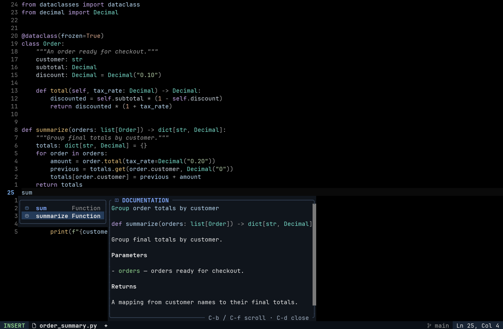

# Perfect Black Neovim

A standalone Neovim configuration: **no LazyVim distribution**. lazy.nvim manages
45 explicitly configured plugins and dependencies, pinned in `lazy-lock.json`.
Pure-black code, italic comments, opaque panels, and **ty + Ruff** for Python.
Ruff provides diagnostics through its LSP and formats with
Ruff Format on save; `<leader>cf` runs formatting manually and `<leader>uf`
toggles format-on-save.

## Workspace


The current theme uses blood-red accents over black editing surfaces.
The dashboard and older editing screenshots below document earlier revisions.

## Editing surfaces





These are actual UI-grid captures from earlier revisions. Completion now uses
Blink; the documentation screenshot shows the previous completion engine.
The Makefile screenshot below is regenerated from the current configuration.

## File browser

Snacks Explorer is the only file browser. Open it with `<leader>e` (toggle)
or `<leader>fe`. Use `<CR>` to open, `a` to create, `r` to rename, `d` to delete,
and `?` for its keymap help. Mini Files and its obsolete decoration code are
removed.

Markdown reader mode is available with `<leader>mr` (or
`:MarkdownReaderEnable`/`:MarkdownReaderDisable`); it enables rendered Markdown,
comfortable wrapping, spelling, concealed syntax, and a distraction-free view,
then restores the previous window settings when toggled off. Rendering is bounded
for very large files and keeps links, code languages, checkboxes, tables, quotes,
and YAML front matter readable.

## Makefile targets


Actual Neovim UI-grid capture of the current configuration. Use `<leader>cm`
or `:Make` to pick a target, `:Make test` to run one directly, and `<leader>cM`
to run the Makefile's default target in a terminal. `:MakePick` also opens the
picker. The picker lists literal targets in the root Makefile; included files,
variable-generated targets, and pattern rules are not expanded. GNU Make runs
the recipe with its normal dependencies and variable expansion.

DAP and its debugger UI are removed. Run `:Lazy clean` to remove unused local
plugin checkouts after updating, then restart Neovim.

## The smaller workflow

- **Mini Pick + Mini Extra:** files, live grep, buffers, commands, diagnostics and
  symbols. Ctrl-P switches between results and preview in the same window.
- **Snacks.explorer:** modern, fast file explorer with tree navigation, git status indicators, LSP integration, floating/sidebar layouts, and built-in file operations.
- **Aerial:** on-demand code outline, with Tree-sitter and LSP backends.
- **Glance:** peek at definitions/references without leaving the source.
- **Quicker:** editable quickfix with expandable context.
- **Tiny Inline Diagnostic:** wrapped cursor-line errors, quiet during insertion.
- **Blink completion:** LSP, paths, snippets and buffer words, with documentation
  and signature help. Enter accepts an explicitly selected item; otherwise it
  inserts a newline. Ctrl-E dismisses completion, Ctrl-K toggles signature help.
- **TreeSJ, incremental rename, selected text objects:** editing tools with no
  permanent panels. Native inlay hints are off until you toggle them.

Snacks provides its explorer, picker, dashboard, terminal, input, indentation and Git UI. Neo-tree, Namu, Colorful Menu and Endhints are
removed. There are no inherited distribution keymaps or background tool installs.

## Keys

`<leader>` is Space.

| Action | Keys |
|---|---|
| Find files / search text | `<leader><space>` / `<leader>/` |
| Buffers / recent files | `<leader>,` / `<leader>fr` |
| Commands / keymaps / help | `<leader>sC` / `<leader>sk` / `<leader>sh` |
| Preview / mark / send marked to quickfix | `Ctrl-P` / `Tab` / `Alt-Enter` in picker |
| Toggle file explorer (Snacks explorer) | `<leader>e` |
| Open file explorer | `<leader>fe` |
| Code outline / find file symbol | `<leader>cs` / `<leader>ss` |
| Find workspace symbol | `<leader>cS` |
| Peek definition / references | `<leader>cgd` / `<leader>cgr` |
| Definition / references / hover | `gd` / `gr` / `K` |
| Rename / code action / format | `<leader>cr` / `<leader>ca` / `<leader>cf` |
| Split/join structure | `<leader>cj` |
| Editable quickfix / expand / collapse | `<leader>xQ` / `>` / `<` |
| Indentation / subword text objects | `ii`, `ai` / `iS`, `aS` |
| Next / previous completion | `Ctrl-N` / `Ctrl-P` (also `Tab` / `Shift-Tab`) |
| Completion docs toggle / open and scroll | `Ctrl-D` / `Ctrl-B`, `Ctrl-F` in insertion |
| Native hints / format-on-save toggle | `<leader>uh` / `<leader>uf` |
| Notification history / dismiss | `<leader>n` / `<leader>un` |
| Makefile target picker / default target | `<leader>cm` / `<leader>cM` |
| Terminal / Git UI | `<leader>ft` / `<leader>gg` |
| Restore session | `<leader>qs` |
| Save / previous buffer / next buffer | `Ctrl-S` / `Shift-H` / `Shift-L` |

Quicker `:w` updates source buffers. Previously unmodified buffers are autosaved;
already modified buffers remain unsaved. Ruff can reformat TreeSJ layouts on save.

Notification history retains the latest 500 messages, capped at 16 KiB each, and
reports discarded records. Errors stay visible until acknowledged; their aggregate
count survives rollover, but older details can age out. History is session-only.

## Setup / update

Requires **Neovim 0.11+**, Git and ripgrep. Select **JetBrainsMono Nerd Font Mono,
13 pt** in the terminal, with its real Italic face. Terminal fonts are not set by Lua.
Use the [repository installer](../Readme.md) for the no-sudo workstation setup.
Run `:IconInfo` to check the configured icon mode. If your terminal cannot use
Nerd Font glyphs, launch with `NVIM_ASCII_ICONS=1 nvim` for clean text icons
instead of boxes or corrupted symbols.

For an existing installation, update the repository, then run `:Lazy restore`.
After checking that the new config works, `:Lazy clean` removes unused plugin
checkouts. This does not remove project data.

Install Python tools with `uv tool install ty` and `uv tool install ruff`, ensuring
uv's executable directory is on PATH before opening Neovim. The bootstrap script
does this automatically and verifies both versions. Ruff uses each project's
Ruff configuration (or Ruff's defaults). `ruff check` remains available for
CI/scripts. `:ConfigTools`
reports missing executables. `:Mason` is available for manual tool management.

Install syntax parsers once (the installer also does this):

```vim
:TSInstall python c cpp lua vim vimdoc query markdown markdown_inline
```

Project roots use canonical paths. Activate your environment before opening
Neovim; restart it after switching environments. Project `.venv` discovery stays
with ty. No environment paths tied to a particular desk are hardcoded.

## Verification

Run `make check` from the repository root with installed plugins, ty on PATH,
and Python `msgpack`. It checks the real Blink completion UI, workflow
regressions and the configured Python language server. Individual commands:

```sh
NVIM_BIN=/path/to/nvim python3 nvim/tests/ui_review.py
nvim --headless -u NONE -l nvim/tests/python_environment.lua
NVIM_TY=/path/to/ty nvim --headless -u NONE -l nvim/tests/real_ty.lua
nvim --headless '+lua dofile("nvim/tests/standalone.lua")' +qa!
python3 nvim/tests/startup_bench.py --runs 5
python3 nvim/tests/capture_makefile.py  # also requires ImageMagick + JetBrainsMono Nerd Font Mono
```

Use your installation's `XDG_DATA_HOME`. UI checks cover Mini Pick files/grep/
preview, diagnostics, notifications, documentation controls, quickfix edits,
Snacks Explorer, Aerial, Glance and rename. The standalone test requires ty on PATH
and verifies actual attachment and diagnostics through the full config.

Tests use temporary files. Headless startup timings do not measure cluster NFS
or interactive language-server latency. See [design decisions](DESIGN.md).
